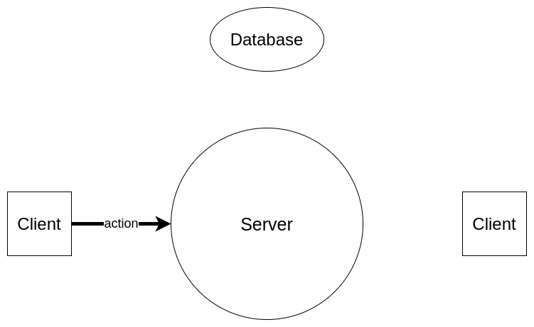
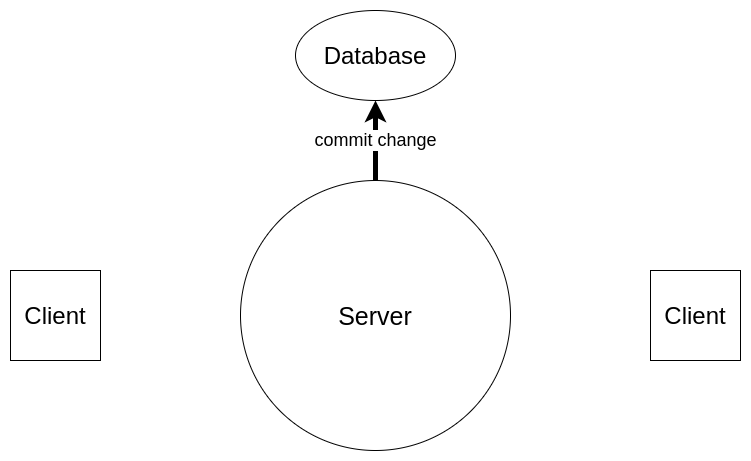
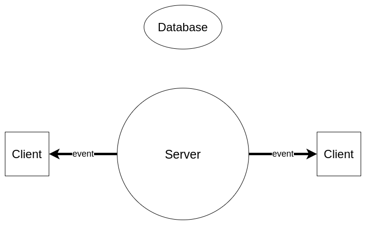
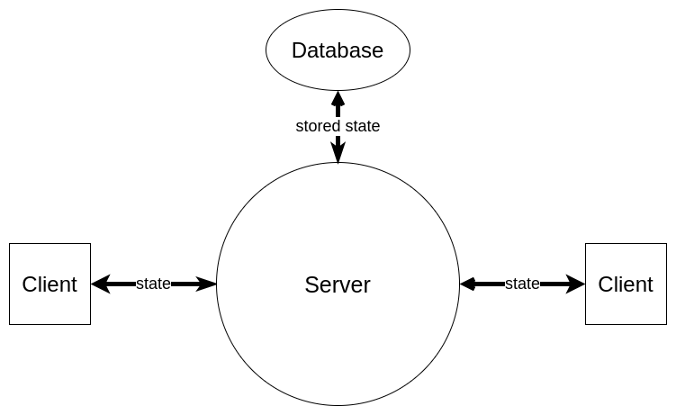

<!-- theme: uncover -->

# Risk Game 667

Artem Akatev

Ryan Shu

Ricardo Colin

Mohammad Ashan

---

## Outline

- Overview

- Specifications

- Technology Used

- Components

- Application Flow

- Demo

---


## Overview

##### Based on risk board game

- 42 territories

- Conquer all 42 to win

- Roll dice to determine winner 

---

## Simplifications

- Only 2 players

- No army separation (Infantry, cavalry, etc)

- No cards

---

## Functional Specs

- Authentication

- Live chat

- Live lobby

- Live gaming experience

---

## Non functional specs

- Fully compatible with Chrome 81+

- Look nice on non-mobile devices

- Deployed on Heroku

- Using Postgres to store data

---

## Technology Used

- Server: JS and Express

- Client: JS and Preact/Vue

- Storage: Postgres

- Tons of dependencies

---


## Components

- Database

- Server

- Lobby

- Chat

- Gameboard

---

## Database

#### Stores:

- Users

- Messages

- Games

- State of each game

---

## Server

#### Key functions

- Processes game state, and chat messages

- Manages users sessions

- Broadcasts events (WS)

- Exposes HTTP API

---

## Lobby, Chat, and Gameboard

#### Key functions

- Listen for events (WS)

- Execute state update logic 

- Rerender the updated state


---

## Example of Application Flow

### Code

#### WARNING! Not a real code!

---

##### Chat Client

```javascripts
class Chat {
  messages = []
  ws.on(MESSAGE_EVENT => this.getMessages)
  
  setMessages(newMessages) { 
    this.messages = newMessages 
  }  
  
  getMessages() { 
    http.get(`/chat/${id}`)
      .then(this.setMessages).catch(displayError) 
  }
  
  sendMessage(message) { 
    http.post('/chat/${id}', message).catch(displayError) 
  }
}
```

---

##### Chat API

```javascripts
router.get('/chat/:id', (request, response) => {
  db.getMessagesByChatId(request.params.id)
    .then(response.json)
    .catch(response.json)
})

router.post('/chat/:id', (request, response) => {
  db.addMessage(request.params.id, 
                request.body.message)
    .then(() => {
      response.json({ error: undefined })
      ws.emit(MESSAGE_EVENT)
    })
    .catch(response.json)
})
```

---

## Example of Application Flow

#### Diagram

---

##### 1. A client creates an action



---

##### 2. Server handles action, and commits change



---
##### 3. Server broadcasts update event



---
##### 4. All subscribed clients syncronize state



---
## Demo

[Link](https://risk-game-667.herokuapp.com/lobby)


---

# Thanks!
